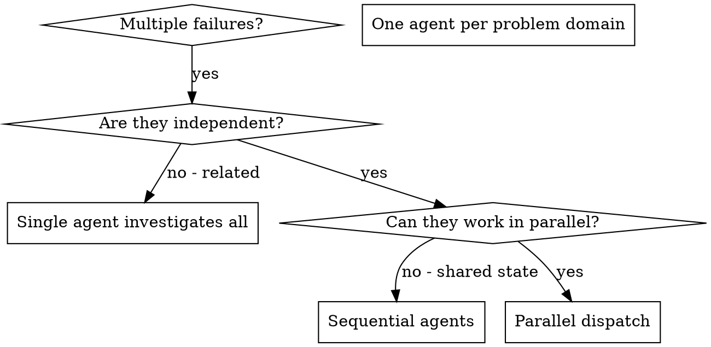

# Dispatching Parallel Agents

## Назначение

Паттерн для параллельного запуска нескольких агентов при наличии 2+ независимых задач, которые можно выполнять без shared state или sequential dependencies. Когда есть несколько несвязанных проблем (разные test files, разные subsystems, разные bugs), последовательное расследование тратит время. Каждое расследование независимо и может происходить параллельно.

## Когда использовать

- 3+ test files failing с разными root causes
- Несколько subsystems broken независимо друг от друга
- Каждая проблема может быть понята без контекста других
- Нет shared state между investigations
- Agents не будут interfere друг с другом
- Failures не связаны (fix одного не исправит другие)
- Не нужно понимать full system state для каждой проблемы

**Core principle:** Dispatch one agent per independent problem domain. Let them work concurrently.

## When to Use



**Use when:**
- 3+ test files failing with different root causes
- Multiple subsystems broken independently
- Each problem can be understood without context from others
- No shared state between investigations

**Don't use when:**
- Failures are related (fix one might fix others)
- Need to understand full system state
- Agents would interfere with each other

---

## CLI Commands

### Parallel Testing

```bash
# Run tests in parallel (Jest)
jest --maxWorkers=4                          # Run with 4 workers
jest --runInBand                             # Run serially (for debugging)
jest --testPathPattern="agent-tool"          # Run specific test pattern

# Run tests in parallel (Pytest)
pytest -n 4                                  # Run with 4 workers (pytest-xdist)
pytest -n auto                               # Auto-detect CPU count
pytest tests/test_agent.py tests/test_tool.py  # Run specific files

# Run tests in parallel (Vitest)
vitest --threads                             # Run with threads
vitest --no-threads                          # Run serially
vitest run --reporter=verbose                # Verbose output

# Run tests in parallel (Go)
go test -parallel 4 ./...                    # Run with 4 parallel tests
go test -v ./...                             # Verbose output
go test -run TestAgent ./...                 # Run specific test pattern
```

### Process Management

```bash
# Run multiple commands in parallel (PowerShell)
$jobs = @()
$jobs += Start-Job -ScriptBlock { pytest tests/test_a.py }
$jobs += Start-Job -ScriptBlock { pytest tests/test_b.py }
$jobs += Start-Job -ScriptBlock { pytest tests/test_c.py }
$jobs | Wait-Job | Receive-Job

# Run multiple commands in parallel (Bash - if available)
pytest tests/test_a.py & 
pytest tests/test_b.py & 
pytest tests/test_c.py &
wait

# GNU Parallel (if installed)
parallel pytest ::: tests/test_a.py tests/test_b.py tests/test_c.py
parallel -j 3 'echo Processing {}' ::: file1 file2 file3
```

### Agent Orchestration

```bash
# Kiro CLI - dispatch multiple agents (conceptual)
kiro agent run --agent=debugger --task="Fix agent-tool-abort.test.ts" &
kiro agent run --agent=debugger --task="Fix batch-completion.test.ts" &
kiro agent run --agent=debugger --task="Fix tool-approval.test.ts" &
wait

# Monitor agent progress
kiro agent list                              # List running agents
kiro agent status <agent-id>                 # Check agent status
kiro agent logs <agent-id>                   # View agent logs
```

### Monitoring & Logging

```bash
# Watch test output in real-time
jest --watch                                 # Watch mode
pytest --looponfail                          # Re-run on failure
vitest --watch                               # Watch mode

# Aggregate logs from parallel runs
Get-Content agent1.log, agent2.log, agent3.log | Sort-Object

# Monitor system resources during parallel execution
Get-Process | Where-Object {$_.ProcessName -like "*node*"} | Select-Object ProcessName, CPU, WorkingSet
```

---

## The Pattern

### 1. Identify Independent Domains

Group failures by what's broken:
- File A tests: Tool approval flow
- File B tests: Batch completion behavior
- File C tests: Abort functionality

Each domain is independent - fixing tool approval doesn't affect abort tests.

### 2. Create Focused Agent Tasks

Each agent gets:
- **Specific scope:** One test file or subsystem
- **Clear goal:** Make these tests pass
- **Constraints:** Don't change other code
- **Expected output:** Summary of what you found and fixed

### 3. Dispatch in Parallel

```typescript
// In Claude Code / AI environment
Task("Fix agent-tool-abort.test.ts failures")
Task("Fix batch-completion-behavior.test.ts failures")
Task("Fix tool-approval-race-conditions.test.ts failures")
// All three run concurrently
```

### 4. Review and Integrate

When agents return:
- Read each summary
- Verify fixes don't conflict
- Run full test suite
- Integrate all changes

## Agent Prompt Structure

Good agent prompts are:
1. **Focused** - One clear problem domain
2. **Self-contained** - All context needed to understand the problem
3. **Specific about output** - What should the agent return?

```markdown
Fix the 3 failing tests in src/agents/agent-tool-abort.test.ts:

1. "should abort tool with partial output capture" - expects 'interrupted at' in message
2. "should handle mixed completed and aborted tools" - fast tool aborted instead of completed
3. "should properly track pendingToolCount" - expects 3 results but gets 0

These are timing/race condition issues. Your task:

1. Read the test file and understand what each test verifies
2. Identify root cause - timing issues or actual bugs?
3. Fix by:
   - Replacing arbitrary timeouts with event-based waiting
   - Fixing bugs in abort implementation if found
   - Adjusting test expectations if testing changed behavior

Do NOT just increase timeouts - find the real issue.

Return: Summary of what you found and what you fixed.
```

## Common Mistakes

**❌ Too broad:** "Fix all the tests" - agent gets lost
**✅ Specific:** "Fix agent-tool-abort.test.ts" - focused scope

**❌ No context:** "Fix the race condition" - agent doesn't know where
**✅ Context:** Paste the error messages and test names

**❌ No constraints:** Agent might refactor everything
**✅ Constraints:** "Do NOT change production code" or "Fix tests only"

**❌ Vague output:** "Fix it" - you don't know what changed
**✅ Specific:** "Return summary of root cause and changes"

## When NOT to Use

**Related failures:** Fixing one might fix others - investigate together first
**Need full context:** Understanding requires seeing entire system
**Exploratory debugging:** You don't know what's broken yet
**Shared state:** Agents would interfere (editing same files, using same resources)

## Real Example from Session

**Scenario:** 6 test failures across 3 files after major refactoring

**Failures:**
- agent-tool-abort.test.ts: 3 failures (timing issues)
- batch-completion-behavior.test.ts: 2 failures (tools not executing)
- tool-approval-race-conditions.test.ts: 1 failure (execution count = 0)

**Decision:** Independent domains - abort logic separate from batch completion separate from race conditions

**Dispatch:**
```
Agent 1 → Fix agent-tool-abort.test.ts
Agent 2 → Fix batch-completion-behavior.test.ts
Agent 3 → Fix tool-approval-race-conditions.test.ts
```

**Results:**
- Agent 1: Replaced timeouts with event-based waiting
- Agent 2: Fixed event structure bug (threadId in wrong place)
- Agent 3: Added wait for async tool execution to complete

**Integration:** All fixes independent, no conflicts, full suite green

**Time saved:** 3 problems solved in parallel vs sequentially

## Key Benefits

1. **Parallelization** - Multiple investigations happen simultaneously
2. **Focus** - Each agent has narrow scope, less context to track
3. **Independence** - Agents don't interfere with each other
4. **Speed** - 3 problems solved in time of 1

## Verification

After agents return:
1. **Review each summary** - Understand what changed
2. **Check for conflicts** - Did agents edit same code?
3. **Run full suite** - Verify all fixes work together
4. **Spot check** - Agents can make systematic errors

## Real-World Impact

From debugging session (2025-10-03):
- 6 failures across 3 files
- 3 agents dispatched in parallel
- All investigations completed concurrently
- All fixes integrated successfully
- Zero conflicts between agent changes

---

## Best Practices

### Agent Dispatch
1. **Identify Independent Domains** - group failures by what's broken, not by symptom
2. **One Agent Per Domain** - each agent focuses on single problem area
3. **Clear Scope** - define boundaries to prevent overlap
4. **Specific Goals** - each agent knows exactly what success looks like
5. **Constraints** - tell agents what NOT to change
6. **Expected Output** - define what agent should return (summary, fixes, analysis)
7. **Context Isolation** - each agent has all context needed, no dependencies
8. **Resource Allocation** - ensure agents don't compete for same resources
9. **Timeout Management** - set reasonable timeouts for each agent
10. **Error Handling** - plan for agent failures

### Task Design
11. **Focused Scope** - one clear problem domain per agent
12. **Self-Contained** - all context needed to understand problem
13. **Specific Output** - what should agent return?
14. **Avoid Overlap** - agents shouldn't edit same files
15. **Test Isolation** - each agent can verify their fixes independently
16. **Documentation** - agents document what they found and fixed
17. **Rollback Plan** - easy to revert if agent makes mistakes
18. **Integration Strategy** - plan how to merge agent results

### Monitoring & Integration
19. **Track Progress** - monitor each agent's status
20. **Review Summaries** - understand what each agent changed
21. **Check Conflicts** - verify agents didn't edit same code
22. **Run Full Suite** - verify all fixes work together
23. **Spot Check** - agents can make systematic errors
24. **Aggregate Logs** - collect logs from all agents
25. **Performance Metrics** - track time saved vs sequential

---

## Checklist для Parallel Agent Dispatch

### Pre-Dispatch
- [ ] Identified 2+ independent problem domains
- [ ] Verified problems are truly independent (no shared state)
- [ ] Grouped failures by root cause or subsystem
- [ ] Defined clear scope for each agent
- [ ] Prepared context for each agent (error messages, test names, relevant code)
- [ ] Set constraints (what agents should NOT change)
- [ ] Defined expected output format (summary, fixes, analysis)
- [ ] Verified agents won't interfere (different files, resources)
- [ ] Set reasonable timeouts for each agent
- [ ] Prepared rollback plan if agents fail

### During Execution
- [ ] Dispatched agents in parallel (not sequential)
- [ ] Monitoring agent progress (logs, status)
- [ ] Tracking resource usage (CPU, memory)
- [ ] Collecting agent outputs (summaries, logs)
- [ ] Watching for conflicts (same file edits)
- [ ] Ready to intervene if agent goes off-track
- [ ] Logging all agent activities for review

### Post-Execution
- [ ] Reviewed each agent's summary
- [ ] Understood what each agent found and fixed
- [ ] Checked for conflicts between agent changes
- [ ] Verified no duplicate fixes (agents solving same problem)
- [ ] Ran full test suite to verify all fixes work together
- [ ] Spot-checked agent changes for quality
- [ ] Integrated all changes into main codebase
- [ ] Documented lessons learned
- [ ] Measured time saved vs sequential approach
- [ ] Identified improvements for next parallel dispatch

---

## Антипаттерны

### ❌ BAD: Too Broad Scope

```markdown
Agent Task: "Fix all the tests"
```

**Проблемы**:
- Agent gets lost in too much context
- Unclear what success looks like
- High chance of conflicts with other agents
- Difficult to review changes

### ✅ GOOD: Focused Scope

```markdown
Agent Task: "Fix the 3 failing tests in agent-tool-abort.test.ts:
1. 'should abort tool with partial output capture'
2. 'should handle mixed completed and aborted tools'
3. 'should properly track pendingToolCount'

Focus on timing/race condition issues. Do NOT change production code."
```

---

### ❌ BAD: No Context

```markdown
Agent Task: "Fix the race condition"
```

**Проблемы**:
- Agent doesn't know where to look
- Wastes time searching for problem
- May fix wrong race condition

### ✅ GOOD: Full Context

```markdown
Agent Task: "Fix race condition in tool-approval-race-conditions.test.ts

Error: Expected execution count to be 1, but got 0

The test expects tool to execute once, but it's not executing at all.
This is likely because the test doesn't wait for async execution to complete.

Test file: src/agents/tool-approval-race-conditions.test.ts
Relevant code: src/agents/tool-executor.ts"
```

---

### ❌ BAD: No Constraints

```markdown
Agent Task: "Fix the tests however you want"
```

**Проблемы**:
- Agent might refactor everything
- Changes too broad to review
- High risk of breaking other code
- Conflicts with other agents

### ✅ GOOD: Clear Constraints

```markdown
Agent Task: "Fix tests in agent-tool-abort.test.ts

Constraints:
- Do NOT change production code in src/agents/
- Do NOT refactor test utilities
- Do NOT increase timeouts arbitrarily
- Fix by replacing timeouts with event-based waiting
- Only modify the test file itself"
```

---

### ❌ BAD: Vague Output

```markdown
Agent Task: "Fix it and let me know"
```

**Проблемы**:
- Don't know what agent changed
- Can't verify fixes without reading all code
- Difficult to integrate with other agents

### ✅ GOOD: Specific Output

```markdown
Agent Task: "Fix tests and return:

1. Root cause analysis (what was broken and why)
2. List of changes made (which files, what changed)
3. Test results (all tests passing?)
4. Any remaining issues or concerns

Format as markdown summary."
```

---

### ❌ BAD: Related Failures Dispatched Separately

```markdown
# All 3 failures are caused by same bug in event emitter
Agent 1: Fix test_event_a.py
Agent 2: Fix test_event_b.py
Agent 3: Fix test_event_c.py
```

**Проблемы**:
- All agents will find same root cause
- Duplicate work
- Potential conflicts (all fixing same code)
- Waste of resources

### ✅ GOOD: Related Failures Grouped

```markdown
# All failures related to event emitter - single agent
Agent 1: Fix all event-related test failures in:
  - test_event_a.py
  - test_event_b.py
  - test_event_c.py

Root cause likely in src/events/emitter.py
```

---

### ❌ BAD: Agents Editing Same Files

```markdown
Agent 1: Refactor src/utils/helpers.ts
Agent 2: Add new function to src/utils/helpers.ts
Agent 3: Fix bug in src/utils/helpers.ts
```

**Проблемы**:
- Merge conflicts guaranteed
- Changes will overwrite each other
- Difficult to integrate
- Wasted effort

### ✅ GOOD: Non-Overlapping Files

```markdown
Agent 1: Fix tests in tests/agent-tool-abort.test.ts
Agent 2: Fix tests in tests/batch-completion.test.ts
Agent 3: Fix tests in tests/tool-approval.test.ts

Each agent works on different file, no conflicts.
```

---

### ❌ BAD: No Integration Plan

```markdown
# Dispatch 5 agents, hope for the best
Agent 1: Fix A
Agent 2: Fix B
Agent 3: Fix C
Agent 4: Fix D
Agent 5: Fix E

# Now what? How to merge?
```

**Проблемы**:
- No plan for merging changes
- Don't know if fixes conflict
- Can't verify all fixes work together
- Risky to deploy

### ✅ GOOD: Clear Integration Plan

```markdown
# Dispatch 3 agents with integration plan
Agent 1: Fix agent-tool-abort.test.ts → Output: summary + git patch
Agent 2: Fix batch-completion.test.ts → Output: summary + git patch
Agent 3: Fix tool-approval.test.ts → Output: summary + git patch

Integration:
1. Review all 3 summaries
2. Check for conflicts (grep for same file edits)
3. Apply patches in order: 1, 2, 3
4. Run full test suite
5. If conflicts, resolve manually
6. Commit all changes together
```

---

## Real Example from Session

**Scenario:** 6 test failures across 3 files after major refactoring

**Failures:**
- agent-tool-abort.test.ts: 3 failures (timing issues)
- batch-completion-behavior.test.ts: 2 failures (tools not executing)
- tool-approval-race-conditions.test.ts: 1 failure (execution count = 0)

**Decision:** Independent domains - abort logic separate from batch completion separate from race conditions

**Dispatch:**
```
Agent 1 → Fix agent-tool-abort.test.ts
Agent 2 → Fix batch-completion-behavior.test.ts
Agent 3 → Fix tool-approval-race-conditions.test.ts
```

**Results:**
- Agent 1: Replaced timeouts with event-based waiting
- Agent 2: Fixed event structure bug (threadId in wrong place)
- Agent 3: Added wait for async tool execution to complete

**Integration:** All fixes independent, no conflicts, full suite green

**Time saved:** 3 problems solved in parallel vs sequentially
