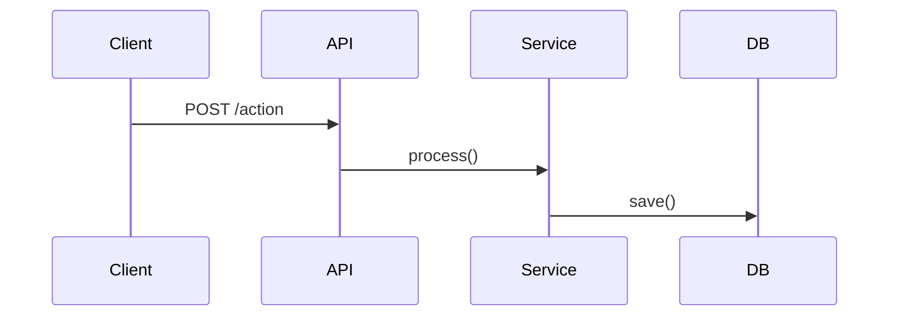

# Specs Workflow (Крупные задачи)

## Когда использовать Specs?

**Крупная задача** — если выполняется хотя бы одно:
- Затрагивает 3+ файлов
- Требует изменения архитектуры
- Новая фича с несколькими компонентами
- Интеграция с внешним сервисом
- Пользователь говорит "сделай X" без деталей

**Мелкая задача** — обычный workflow:
- Баг в одном файле
- Рефакторинг функции
- Добавление поля в форму

---

## Workflow для крупных задач

```
1. REQUIREMENTS  →  2. DESIGN  →  3. TASKS  →  4. EXECUTE (по одной)
   @project-analyzer    @architect     orchestrator   @coder → QA
```

### Фаза 1: Requirements (Сбор требований)

**Оркестратор спрашивает пользователя:**
```
📋 Это крупная задача. Мне нужны детали:

1. Что должна делать фича? (user story)
2. Какие данные нужны? (входы/выходы)
3. Есть ли ограничения? (производительность, безопасность)
4. Как проверить что готово? (acceptance criteria)

Или скажи "разберись сам" — я проанализирую проект.
```

**Если "разберись сам":**
```
task → @project-analyzer: "Проанализируй проект и предложи requirements для {задача}"
```

**Результат:** Создаётся `.specs/{feature}/requirements.md`

### Фаза 2: Design (Архитектура)

```
task → @backend-architect или @api-architect:
  "Спроектируй решение для requirements:
   {содержимое requirements.md}
   
   Нужно:
   - Какие файлы создать/изменить
   - Структура данных
   - Sequence diagram (если сложно)
   - Риски и альтернативы"
```

**Результат:** Создаётся `.specs/{feature}/design.md`

### Фаза 3: Tasks (Разбивка на задачи)

**Оркестратор сам создаёт tasks.md на основе design.md:**

```markdown
# Tasks: {feature}

## Task 1: Создать модель данных
- [ ] Файл: src/models/User.ts
- [ ] Агент: @backend-developer

### Subtasks:
- [ ] 1.1: Создать интерфейс IUser
- [ ] 1.2: Создать класс User
- [ ] 1.3: Добавить валидацию email
- [ ] 1.4: Экспортировать из index.ts

## Task 2: Создать API endpoint
- [ ] Файл: src/api/auth.ts
- [ ] Агент: @backend-developer

### Subtasks:
- [ ] 2.1: POST /register endpoint
- [ ] 2.2: POST /login endpoint
- [ ] 2.3: Middleware проверки токена
```

**КРИТИЧНО: Каждая Task имеет Subtasks!**
- Агент видит конкретные шаги
- Выполняет subtask за subtask
- Может запросить контекст для конкретного subtask

**Показать пользователю:**
```
📋 План выполнения:

Task 1: Создать модель данных (4 subtasks)
  1.1: Создать интерфейс IUser
  1.2: Создать класс User
  1.3: Добавить валидацию email
  1.4: Экспортировать из index.ts

Task 2: Создать API endpoint (3 subtasks)
  2.1: POST /register endpoint
  2.2: POST /login endpoint
  2.3: Middleware проверки токена

[1] Выполнить всё
[2] Выполнять по одной задаче (рекомендую)
[3] Изменить план
```

### Фаза 4: Execute (Выполнение по одной)

**КРИТИЧНО: Выполнять задачи ПО ОДНОЙ!**

```
Для каждой Task:
1. task → @coder: "Выполни Task N:
   {полное описание}
   
   Subtasks:
   - [ ] N.1: {описание}
   - [ ] N.2: {описание}
   
   Выполняй subtask за subtask.
   Если нужен контекст — запроси у @code-archaeologist."

2. task → @code-reviewer: "Проверь изменения"
3. Если баги → @debugger с ПОЛНЫМ контекстом
4. Обновить статус subtasks в tasks.md: [x]
5. Следующая задача
```

**Агент может запросить контекст:**
```
Агент: "Мне нужен контекст для subtask 2.3. 
        Запроси у @code-archaeologist: как реализован middleware в других файлах?"

Оркестратор:
  task → @code-archaeologist: "Найди примеры middleware в проекте"
  ← результат
  → передаёт агенту для продолжения
```

**После всех задач:**
```
task → @documentarist: "Обнови память: завершена фича {feature}"
```

---

## Структура .specs/

```
.specs/
├── user-authentication/
│   ├── requirements.md    # User stories + acceptance criteria
│   ├── design.md          # Архитектура от @architect
│   └── tasks.md           # Список задач со статусами
├── shopping-cart/
│   ├── requirements.md
│   ├── design.md
│   └── tasks.md
└── ...
```

---

## Формат requirements.md

```markdown
# Requirements: {Feature Name}

## User Story
Как {роль}, я хочу {действие}, чтобы {цель}.

## Acceptance Criteria (EARS)

### REQ-1: {Название}
WHEN {условие}
THE SYSTEM SHALL {поведение}

### REQ-2: {Название}
WHEN {условие}
THE SYSTEM SHALL {поведение}

## Constraints
- Производительность: {требования}
- Безопасность: {требования}
- Совместимость: {требования}

## Out of Scope
- {Что НЕ входит в задачу}
```

---

## Формат design.md

```markdown
# Design: {Feature Name}

## Overview
{Краткое описание решения}

## Architecture

### Components
| Компонент | Файл | Описание |
|-----------|------|----------|
| Model | src/models/X.ts | Структура данных |
| API | src/api/X.ts | Endpoints |
| Service | src/services/X.ts | Бизнес-логика |

### Data Flow


## Risks & Mitigations
| Риск | Митигация |
|------|-----------|
| {риск} | {решение} |

## Alternatives Considered
- {Альтернатива 1}: Отклонена потому что...
```

---

## Формат tasks.md

```markdown
# Tasks: {Feature Name}

Status: IN_PROGRESS | COMPLETED | BLOCKED

## Task 1: {Название}
- Status: [ ] pending | [x] done | [!] blocked
- Agent: @{agent-name}
- Files: {список файлов}
- Description: {что сделать}
- Acceptance: {как проверить}

### Subtasks:
- [ ] 1.1: {конкретное действие}
- [ ] 1.2: {конкретное действие}
- [ ] 1.3: {конкретное действие}

**Контекст:** Если нужна доп. информация — запроси у @code-archaeologist

## Task 2: {Название}
...
```

**Правила subtasks:**
- Каждый subtask = одно конкретное действие
- Агент выполняет subtask за subtask
- Можно запросить контекст для любого subtask
- Статус обновляется после каждого subtask

---

## Anti-Patterns

```
❌ Начинать кодить без requirements
❌ Пропускать фазу design для крупных задач
❌ Выполнять все tasks скопом
❌ Не обновлять статус в tasks.md
❌ Игнорировать риски из design.md
❌ Передавать кодеру задачу без контекста из spec
```

---

## Пример диалога

**Пользователь:** Сделай авторизацию через JWT

**Оркестратор:**
```
📋 Это крупная задача. Создаю spec...

Мне нужны детали:
1. Какие роли пользователей? (admin, user, guest?)
2. Refresh tokens нужны?
3. Где хранить токены? (localStorage, httpOnly cookie?)
4. Срок жизни токена?

Или скажи "разберись сам".
```

**Пользователь:** разберись сам, стандартная авторизация

**Оркестратор:**
```
task → @project-analyzer: "Проанализируй проект и предложи requirements для JWT авторизации"
← requirements

task → @backend-architect: "Спроектируй JWT авторизацию: {requirements}"
← design

📋 План:
1. Создать User модель
2. Создать auth service
3. Создать /login, /register endpoints
4. Добавить middleware проверки токена
5. Написать тесты

Выполнять по одной? [Y/n]
```
