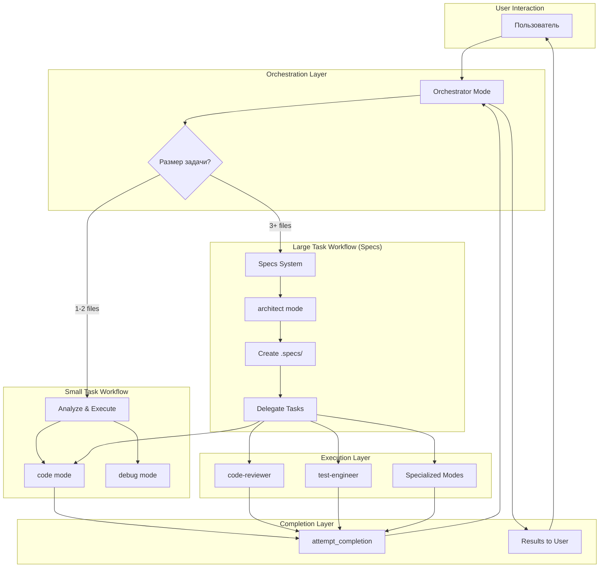

# Анализ адаптации OpenCode Agent System под Kilo Code

## Executive Summary

На основе глубокого анализа системы OpenCode Agent System предложена стратегия адаптации под архитектуру Kilo Code с учётом встроенных режимов, механизма делегирования через `new_task` и системы завершения через `attempt_completion`.

---

## 1. Анализ существующей системы OpenCode

### 1.1 Структура агентов (agents/)

Агенты организованы по функциональным категориям:

```
agents/
├── architecture/          # Архитекторы
│   ├── backend-architect.md
│   ├── api-architect.md
│   ├── graphql-architect.md
│   └── database-optimizer.md
├── language-experts/      # Языковые эксперты
│   ├── typescript-expert.md
│   ├── python-pro.md
│   ├── golang-pro.md
│   └── rust-pro.md
├── development/           # Разработчики
│   ├── frontend/
│   │   ├── frontend-developer.md
│   │   ├── react-expert.md
│   │   └── nextjs-specialist.md
│   ├── backend/
│   │   └── backend-developer.md
│   └── general-coder.md
├── quality-assurance/     # QA
│   ├── code-reviewer.md
│   ├── debugger.md
│   ├── test-automator.md
│   ├── security-auditor.md
│   └── accessibility-specialist.md
├── orchestration/         # Оркестрация
│   ├── project-analyzer.md
│   ├── code-archaeologist.md
│   └── context-manager.md
├── design/                # Дизайн
│   ├── ui-ux-designer.md
│   └── tailwind-css-expert.md
└── specialized-tools/     # Специализированные
    ├── game-developer.md
    └── legacy-modernizer.md
```

**Всего:** ~40+ агентов

### 1.2 Система навыков (skills/)

Навыки - это markdown-файлы с инструкциями, которые агенты загружают по требованию:

- **70+ навыков** в различных областях
- Ленивая загрузка (lazy loading) - только когда нужно
- Структура: frontmatter + markdown content
- Примеры: typescript/, debugging-strategies/, senior-architect/, error-resolver/

### 1.3 Workflow система (docs/)

#### Мелкие задачи (workflow-small.md)
```
1. Определить размер задачи (1-2 файла)
2. Собрать контекст (при необходимости)
3. Показать план пользователю
4. Делегировать агенту через task tool
5. Получить JSON результат
6. Эскалировать ошибки при необходимости
```

#### Крупные задачи (workflow-large.md)
```
1. REQUIREMENTS → @project-analyzer
2. DESIGN → @backend-architect
3. TASKS → orchestrator создаёт tasks.md
4. EXECUTE → по одной задаче через @coder
```

### 1.4 Specs система (.specs/)

```
.specs/
├── _templates/
│   ├── requirements.md    # User stories + acceptance criteria
│   ├── design.md          # Архитектура
│   └── tasks.md           # Разбивка на задачи
└── {feature-name}/        # Конкретные фичи
    ├── requirements.md
    ├── design.md
    └── tasks.md
```

### 1.5 Правила (CODING_RULES.md)

- **Максимум 300 строк** на файл
- **Обязательное логирование**
- **Проверка перед сдачей** (npm run dev)
- **JSON формат ответов** от агентов

---

## 2. Маппинг агентов OpenCode → режимы Kilo Code

### 2.1 Tier 1: Прямое соответствие (уже есть в Kilo Code)

| OpenCode Agent | Kilo Code Mode | Когда использовать |
|----------------|----------------|-------------------|
| `backend-architect`<br>`api-architect`<br>`graphql-architect` | **architect** | Проектирование архитектуры, выбор стека, API design |
| `frontend-developer`<br>`backend-developer`<br>`general-coder` | **code** | Написание кода, рефакторинг, имплементация |
| `debugger` | **debug** | Отладка ошибок, поиск багов, исправления |
| `test-automator` | **test-engineer** | Написание тестов, QA, покрытие |
| `code-reviewer` | **code-reviewer** | Ревью кода, quality gates |
| `ui-ux-designer` | **frontend-specialist** | Frontend, UI/UX, компоненты |
| `security-auditor` | **code-skeptic** | Аудит безопасности, поиск уязвимостей |
| `documentation-specialist` | **docs-specialist** | Документация, README, API docs |

### 2.2 Tier 2: Требуют адаптации (custom modes/instructions)

| OpenCode Agent | Предлагаемый Mode | Что адаптировать |
|----------------|-------------------|------------------|
| `project-analyzer` | **ask** + инструкции | Добавить инструкции для анализа проекта, структуры, стека |
| `code-archaeologist` | **ask** + инструкции | Поиск кода, расследование legacy, зависимости |
| `typescript-expert` | **code** + custom instructions | TypeScript-specific patterns, strict types |
| `python-pro` | **code** + custom instructions | Python-specific patterns, async, typing |
| `golang-pro` | **code** + custom instructions | Go-specific patterns, concurrency |
| `rust-pro` | **code** + custom instructions | Rust-specific patterns, memory safety |
| `database-optimizer` | **code** + инструкции | SQL оптимизация, индексы, запросы |
| `accessibility-specialist` | **code** + инструкции | WCAG, a11y проверки, семантика |
| `database-architect` | **architect** + инструкции | Схемы БД, миграции |

### 2.3 Tier 3: Специализированные (отдельные modes или skills)

| OpenCode Agent | Стратегия адаптации |
|----------------|---------------------|
| `learning-extractor` | Интегрировать в orchestrator workflow как авто-извлечение паттернов |
| `game-developer` | Создать отдельный mode или использовать code + game-dev skills |
| `legacy-modernizer` | Использовать code + refactoring skills |
| `langgraph-specialist` | Создать отдельный mode для LangGraph workflows |
| `llm-service-specialist` | Создать отдельный mode для LLM интеграций |
| `mobile-developer` | Использовать code + mobile-specific skills |

---

## 3. Что можно адаптировать 1:1

### 3.1 Skills → Custom Instructions

Навыки OpenCode можно перенести как:
- **Custom instructions** внутри mode definitions
- **Отдельные reference файлы** для чтения через read_file
- **Conditional loading** - подгрузка нужного skill перед задачей

**Пример адаптации:**
```markdown
# Было в OpenCode (skills/typescript/SKILL.md)
---
name: typescript
description: TypeScript strict patterns
---
# TypeScript Skill
## Const Types Pattern (ОБЯЗАТЕЛЬНО)
...

# Стало в Kilo Code (custom instructions)
## TypeScript Expert Instructions
When working with TypeScript:
1. Always use Const Types Pattern
2. Keep interfaces flat (one level nesting max)
3. Use strict type checking
...
```

### 3.2 CODING_RULES.md → Mode Rules

Правила кодирования можно встроить в:
- **code mode** custom instructions
- **Отдельный файл** `.kilo/rules/coding-rules.md`
- **Pre-prompt** для всех coding modes

### 3.3 Specs Templates → Project Templates

Шаблоны specs можно использовать как есть:
- `requirements.md` → сбор требований
- `design.md` → архитектурное проектирование
- `tasks.md` → разбивка на подзадачи

### 3.4 Workflow Logic → Orchestrator Logic

Логика workflow-small и workflow-large адаптируется в:
- **Orchestrator mode** - центральный координатор
- **Decision trees** - логика выбора режима
- **Task delegation patterns** - шаблоны делегирования

---

## 4. Что нужно создать заново

### 4.1 Orchestrator Mode

**Назначение:** Центральный режим для координации сложных задач

**Функции:**
- Определение размера задачи (small vs large)
- Выбор подходящего workflow
- Делегирование через `new_task`
- Получение результатов через `attempt_completion`
- Эскалация ошибок
- Управление specs

**Ключевые отличия от OpenCode:**
- OpenCode: orchestrator это отдельный агент, вызывает других через task tool
- Kilo Code: orchestrator это mode, делегирует через new_task

### 4.2 Specs Management System

**Нужно создать:**
- Логику создания specs директорий
- Templates для requirements/design/tasks
- Отслеживание статуса задач
- Интеграцию с todo lists

### 4.3 Skill Loading Mechanism

**Нужно создать:**
- Способ динамической подгрузки skills
- Интеграцию skills в custom instructions
- Lazy loading (по требованию)

**Варианты реализации:**
1. Чтение skill файла перед делегированием
2. Включение skills в mode definitions
3. Hybrid подход

### 4.4 Task Delegation Logic

**Нужно создать:**
- Карту соответствия задач → режимов
- Логику выбора режима на основе контекста
- Шаблоны сообщений для new_task

---

## 5. Рекомендуемая структура адаптированной системы

```
.kilo-system/
├── modes/
│   ├── orchestrator/
│   │   └── mode.md              # Главный оркестратор
│   ├── code-with-skills/
│   │   ├── mode.md              # Code mode + skill loading
│   │   └── skills/
│   │       ├── typescript.md
│   │       ├── python.md
│   │       ├── golang.md
│   │       ├── rust.md
│   │       └── architecture.md
│   └── specialized/
│       ├── database-optimizer.md
│       ├── accessibility-specialist.md
│       └── project-analyzer.md
├── workflows/
│   ├── small-task.md            # Для 1-2 файлов
│   └── large-task.md            # Для 3+ файлов (specs)
├── specs/
│   └── templates/
│       ├── requirements.md
│       ├── design.md
│       └── tasks.md
├── skills/                      # Skill library
│   ├── debugging/
│   │   ├── debugging-strategies.md
│   │   └── error-resolver.md
│   ├── architecture/
│   │   ├── senior-architect.md
│   │   └── microservices-patterns.md
│   ├── performance/
│   │   └── optimizing-performance.md
│   └── languages/
│       ├── typescript-advanced.md
│       ├── python-async.md
│       └── rust-memory.md
├── rules/
│   ├── coding-rules.md          # Из CODING_RULES.md
│   └── subagent-rules.md        # Правила делегирования
└── docs/
    ├── agent-mapping.md         # Полный маппинг агентов
    ├── migration-guide.md       # Руководство по миграции
    └── architecture-diagram.md  # Архитектура системы
```

---

## 6. Архитектура адаптированной системы



---

## 7. Пошаговый план миграции

### Phase 1: Foundation (Базовая инфраструктура)
- [ ] Создать структуру директорий `.kilo-system/`
- [ ] Портировать `CODING_RULES.md` → `.kilo-system/rules/`
- [ ] Портировать specs templates → `.kilo-system/specs/templates/`
- [ ] Создать полный маппинг агентов → режимов

### Phase 2: Core Modes (Ключевые режимы)
- [ ] Создать **orchestrator mode**
- [ ] Адаптировать skills для **code mode**
- [ ] Создать workflow definitions (small/large)
- [ ] Интегрировать с существующими modes (architect, debug, test-engineer)

### Phase 3: Specialized Modes (Специализированные режимы)
- [ ] Создать **project-analyzer** mode (based on ask)
- [ ] Создать **code-archaeologist** mode (based on ask)
- [ ] Адаптировать language-specific skills
- [ ] Создать specialized modes (database-optimizer, accessibility-specialist)

### Phase 4: Integration (Интеграция)
- [ ] Создать migration guide
- [ ] Написать тестовые сценарии
- [ ] Документировать best practices
- [ ] Обучить workflow на примерах

---

## 8. Ключевые рекомендации

### 8.1 Принципы адаптации

1. **Не реплицировать 1:1** - Kilo Code имеет другую архитектуру, используйте её сильные стороны
2. **Использовать встроенные режимы** - architect, code, debug, test-engineer уже оптимизированы
3. **Адаптировать лучшие практики OpenCode** - specs система, skills, coding rules
4. **Создать orchestrator mode** - для координации сложных задач
5. **Сохранить specs workflow** - очень эффективен для крупных задач

### 8.2 Что оставить от OpenCode

- ✅ Specs система (requirements → design → tasks)
- ✅ Coding rules (300 строк макс, логирование)
- ✅ Skills library (адаптировать под custom instructions)
- ✅ Workflow логика (small vs large tasks)
- ✅ Agent selection logic (какой агент для какой задачи)

### 8.3 Что использовать от Kilo Code

- ✅ Встроенные режимы (architect, code, debug, test-engineer)
- ✅ `new_task` для делегирования
- ✅ `attempt_completion` для результатов
- ✅ Custom modes для специализации
- ✅ MCP интеграции

### 8.4 Что создать новое

- 🆕 Orchestrator mode
- 🆕 Specs management logic
- 🆕 Skill loading system
- 🆕 Task delegation mapping
- 🆕 Integration layer

---

## 9. Заключение

Адаптация OpenCode Agent System под Kilo Code требует:

1. **Понимания различий архитектур** - OpenCode использует task tool, Kilo Code использует new_task
2. **Сохранения лучших практик** - specs система, skills, coding rules
3. **Создания orchestrator mode** - для координации
4. **Адаптации агентов** - маппинг на существующие и создание новых режимов
5. **Интеграции workflow** - small и large task workflows

**Ожидаемый результат:** Система, сочетающая лучшее из обоих миров - мощную оркестрацию OpenCode с гибкостью и встроенными режимами Kilo Code.

---

*Анализ выполнен: 2026-01-30*
*Версия: 1.0*
